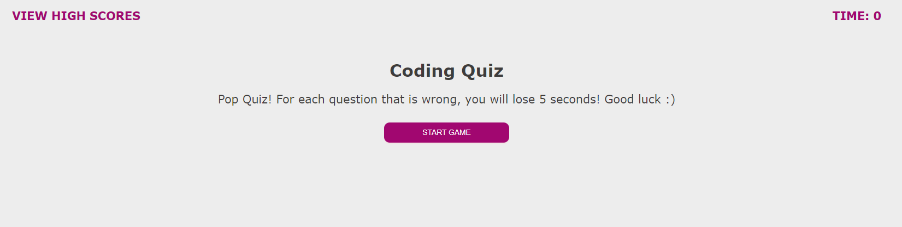

# under-the-sea

## Description

The goal of this project is create a webpage that contains a timed coding quiz. Once the start button is pressed, the timer will start, and the first question will be presented. When a question is answered, another question will follow. When a question is answered incorrectly, there will be a timer penalty, and time will be subtracted from the clock. Once all the questions have been answered, or the timer has reached 0, the game is over. When the game is over, the user will be able to save their initials and score. When the high scores page is refreshed, the score will still be present. 

For this project, the main objective was to create a coding quiz from scratch. As such, HTML, CSS, and 

In the HTML file, multiple `
` tags are used, but it is important to note that they are used along with multiple different "id" and "class" attributes. Most importantly, the `
` tags help to separate the webpage into different sections based on the information within those sections. `<button>` was used to help create the buttons that were necessary for this page to function. The `<form>` tag is necessary as it allows users to submit their initial and score to be stored in the high scores list. 

In the CSS file, the use of the `id` and `class` attributes come into play as they help define the layout of the webpage. The use of the `flex` property is important as it helps the questions and answer choices be formatted to the webpage. Media queries such as `@media screen` was used to allow the webpage to adapt to a smaller device. 

The main work was within the JavaScript file. Most importantly, it was important to define all of the variables that are used within functions. Arrays were specifically created for high scores, questions, and the corresponding answer choices. A key function that stands out is `var startGame = function() {`; with this function, the game starts, the timer starts, and the first question choice is revealed. To have the questions appear randomly, the `Math.random` was used to randomize the way that questions appeared. `addEventListener` is used throughout the JavaScript file as it listens for the click from the mouse, and the event will occur afterwards. `localStorage` is used to store the high scores and initials to the local machine, and allows for these elements to be stored even when the page is refreshed. Lastly, throughout the JavaScript, CSS, and HTML file, multiple comments are written to note what the code is actually doing. 

[Link to webpage](https://snehitak20.github.io/under-the-sea/)

## Technologies Used: 
- HTML5
- CSS3
- JavaScript

## Usage

To start the quiz, press the start button. Complete the quiz, and enter your initials in the form when prompted. Click the  "View High Scores" page to view high scores. Clear the high scores page by clicking the "Clear High Scores" button. Use the "Go Back" button to navigate back to the start page of the quiz. 

## Installation

1. Create a new repository on Github. 
    - Press the "+" sign on the top right hand corner, or the "new" button on your GitHub homepage. 
    - Create an unique name for your repository, and make the respository public. 
    - Click the "README" option to include the "README" page. 
    - Your new repository has been created.
2. Open GitBash (PC users) or Terminal (Mac users).
    - Navigate to where you want to clone your new repository onto your local machine. 
        - Use `cd` to help you navigate. 
3. To clone the new repository onto your local machine. 
    - Click the respository that you just made on github.com.
    - Click the "code" button and choose the SSH option. 
    - Copy the SSH option to your clipboard. 
    - On GitBash/Terminal, enter the command `git clone git@github.com:<UserNAME>/<demo-repo>.git`
        - After `git clone`, paste the SSH option from your clipboard into GitBash/Terminal.
        - Since the SSH option was used, enter the password for the SSH key when asked. 
4. You have now cloned your new repository.
    - Using `cd`, navigate into your new repository from the location that you have saved it in. 
    - Use `ls` to see what is inside the new repository currently. 
        - It should only include the README page as of now.
5. Tranferring the project files into your new directory on your local machine. 
    - Using Finder/Explorer, copy the corresponding files that are needed to edit your project. 
    - In another Finder/Explorer window, navigate to your new repository, and paste the files directly into that folder. 
6. On GitBash/Terminal, after pasting the project files into the new repository. 
    - Use `ls` to see what is now inside the new repository.
        - This should now include the README page, and the project files that you have copy-pasted in. 
7. Use `git status` to see if there any changes that need to be made to the repository. 
    - At this point, git will tell you that there is an untracked file .
8. Use `git add .` to add the new project files, and allow the new files to be tracked by git.
9. Use `git commit -m "add base project files"` to commit the changes have recently been made to the repository. 
10. Use `git push origin main` to sync your local machine with GitHub. 
    - Enter your SSH password when prompted. 
11. Use `code .` to open the files on a code reader of your choice.
12. Edit the files as necessary in your code reader. 
13. Periodically, and when you are finished with editing your code: 
    - Follow Steps 7-10 to keep your repository up to date with the changes that have been made. 
14. How to deploy the webpage:
    - After one final push to the repository, direct yourself to the repository's settings. 
    - Click the "pages" option from the sidebar. 
    - Select "main branch" as the source, and check that it selected for the "root" option. 
    - Click "Save" to deploy your webpage. 
    - *Give 5-10 minutes for the webpage to display the full contents.
15. You have successfully completed this project!

## Credits

Initial prompt given by UC Berkeley Extension, Coding Bootcamp. 

## Reflection

For this project, it was important to learn how to define global variables. Without them, functions could not have been written appropriately. It was also important to learn about the use of `localStorage, JSON.parse(), and JSON.stringify` in order to store data from the webpage, and have it still be present when refreshing the webpage. Lastly, the use of 
`(Math.random())` to generate randomized questions was an important function to learn. This project stands out because it has a functional coding quiz where the user can enter their initial and high scores at the end of the quiz. 

## License
Licensed under the [MIT](https://choosealicense.com/licenses/mit/#) license. 
